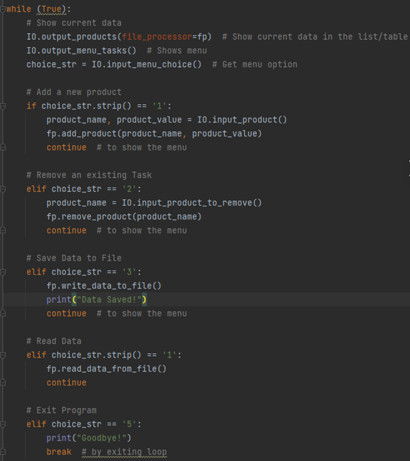

Lauren Ferrier

December 12, 2022

Foundations of Programming, Python

Assignment 08

[Git Hub Repository](https://github.com/laf2012/laf2012-ITFnd100-Mod08)

[Git Hub Website](https://laf2012.github.io/laf2012-ITFnd100-Mod08/)

# Managing Products - A Python Script of Classes, Constructors, Properties & Methods

# Introduction

This document details the steps taken to create a script for managing a growing list of products and their values. This script involves several concepts explored in past modules such as: writing/reading data to a file, displaying an interactive menu to a user for their inputs, error handling, and lists. However, we are now expanding upon these concepts with greater organization via more detailed classes and accompanying constructors, properties, and methods.

# Steps Taken for Assignment 08

1. This assignment was completed within [PyChar](https://www.jetbrains.com/pycharm/download/#section=windows)[m](https://www.jetbrains.com/pycharm/download/#section=windows)[(](https://www.jetbrains.com/pycharm/download/#section=windows)Jet Brains, 2022).

2. Within PyCharm, I opened the \_Assignment08-Starter.py that was provided with this week's course materials. This script contained the pseudo-code that will guide us on which aspects of our script that we will be focusing on. To start, we were provided with two global variables and the task of defining our product class.
 

_Figure 1 As explored in last week's module, we begin with a class definition, which will serve as a blueprint for our script._

3. This class requires an expansion on how we have worked with classes previously since we now will be introducing the principles of constructors, properties, and methods. To assist with this, I referenced our week's module notes, in particular, Lab 8-5 (\_MOD7PYTHONPROGRAMMINGNOTES.DOCX 2022, PG 16.).

4. Referencing the above, I first tackled creating the constructor and attributes of our class. To understand why we need to begin here, it's critical to understand that the class in this script will be serving as our blueprint. A class isn't directly an object, but it's designed for one, and many objects can be created from this class. In this class, our _objects_ are our hypothetical objects and their values (PYTHON PROGRAMMING FOR THE ABSOLUTE BEGINNER 3RD ADDITION, MICHAEL DAWSON, CENGAGE LEARNING 2010, P. 219). But to keep these two datapoints organized, we additionally want to introduce a constructor which will setup the initial attribute values of our object (PYTHON PROGRAMMING FOR THE ABSOLUTE BEGINNER 3RD ADDITION, MICHAEL DAWSON, CENGAGE LEARNING 2010, P. 222).
 

_Figure 2 Our **constructor** is using a specific method name recognized by Python and triggered by using **\_\_init\_\_**. This constructor is called by any newly created Product object that emerges when our script is implemented (PYTHON PROGRAMMING FOR THE ABSOLUTE BEGINNER 3RD ADDITION, MICHAEL DAWSON, CENGAGE LEARNING 2010, P. 224-225). Additionally, we also have defined **attributes** along with our constructor ( **product\_name** & **product\_value** ), which are triggered by using the self keyword. This keyword refers to the data found in our object instance versus directly in the class (\_MOD7PYTHONPROGRAMMINGNOTES.DOCX 2022, PG 7.)._

5. We next want to define our properties. This will assist us with managing our attribute data. For our script, we will be creating two properties for each of our attributes (_product\_name_ & _product\_value_), which will be defined via a getter and setter. We additionally have added error handling to our property setters since we want to ensure that our _product\_names_ are truly names and that their corresponding values are integers only.
 

_Figure 3 Each of our attributes have been given **getter** and **setter properties**. The getter property permits us to access the data and add formatting details. This is triggered via the **@propoerty** decorator. Alternatively, the setter property permits us to add code for validation and error handling. This is triggered via the **@name\_of\_property.setter decorator** (\_MOD8PYTHONPROGRAMMINGNOTES.DOCX 2022, PG 10.)._

6. Lastly for our Product class, we want to define the method. Methods can be thought of as functions associated with objects. These instance methods must include a self parameter, which is a way for the method to refer to the object itself (PYTHON PROGRAMMING FOR THE ABSOLUTE BEGINNER 3RD ADDITION, MICHAEL DAWSON, CENGAGE LEARNING 2010, P. 221).
 

_Figure 4 This method will be returning our class data (product\_name & product\_value) back as a string. This is indicated by invoking **the \_\_str\_\_()** method (\_MOD8PYTHONPROGRAMMINGNOTES.DOCX 2022, PG 12 -14)._

7. With our Product class defined, we now want to consider the next steps in our script. Eventually we will be presenting our user a menu to input these products and their values. However, underneath this interaction lies all the behind-the-scenes work (from our user's perspective), which involves functions that permit our user to add, remove, review, and save to a growing list. To keep all these functions organized, we want to create an additional class entitled _FileProcessor_. Like the _Product_ class, we will additionally create an accompanying constructor with associated attributes as well.

 

_Figure 5 Our defined **FileProcessor class** and **attributes** of **file\_name** and **ProductsList**. Note that in Figure 1 that we had a global variable that handled **ProductsList**. We instead are defining that variable here as an attribute for better organization. Additionally, as opposed to our Product class, we are not defining this as an object class since this class deals more strictly with methods versus the more detailed attributes and properties in our Product class._

8. We then want to consider the objectives outlined above that we want performed by our script. For each of these functions, we want to define a method.

 

_Figure 6 To assist with formatting these methods, I referenced the **static methods** created back in assignment 06 since this involved the same baseline functions. However, we are converting these methods away from being static using the self keyword. This is because we are working these methods through the objects defined in our Product class. Since these objects will be referencing these methods, we do not want them to remain static (PYTHON PROGRAMMING FOR THE ABSOLUTE BEGINNER 3RD ADDITION, MICHAEL DAWSON, CENGAGE LEARNING 2010, P. 231-232)._

9. With our _FileProcessor_ class defined, we can now consider our user's end visuals within our script. To handle this, we will create one last class: _IO_. To assist with this, I again referenced the script created for Assignment 06 for the same reasons outlined in Figure 6 above. Several tweaks were made to this inspirational code to accommodate our updated goal of working with products and to continue working with the error handling concept introduced in step 5 via a while loop for our _input\_product_ method.
 

_Figure 7 A sample of our various methods that make up our **IO class**. Note that we chose to make these methods static via **@staticmethod** since we don't necessarily need these methods to reference back to the objects resulting from our Product class._

10. To accommodate giving our user the option to read back the current data saved to their growing product list, an additional method was created for this task. Which I then realized required an additional method in our _FileProcessor_ class to assist with a streamlined way of viewing this data.
 

_Figure 8 Our method for permitting a user to review the products currently in their list.

 

_Figure 9 Our new and simple method added to our FileProcessor class._

11. This next brings us to the main body of our script. Firstly, referencing back to _Figure 1_ where we had a global variable of _strtFileName = Products.txt_, I decided to move this variable to my main body.
 

_Figure 10 This variable of **fp** will be how we tell our script to process the variety of potential options that our user will be passing to the Products.txt (read and write functions)._

12. Once more, I then referenced the main body script introduced in Assignment 06 with several tweaks. Mainly to ensure that our updated method names are referenced. Additionally, since the classes in our current assignment are much more detailed (containing constructors, attributes, and methods), we can do away with more tedious detail for better organization.
 

_Figure 11 Note that we have laid out our while loop logic that will guide our user through their products menu. However, unlike in the similar script for Assignment 06, we do not need to define all our involved variables since those are handled in our previous classes. The result is much more clean main body of code._

13. We now have our script complete!
  
_Figure 9 Completed Assignment 08. As shown in PyCharm._

 _
Figure 10 Completed Assignment 07, as shown in a command window._

_Figure 11 Resulting Products.txt from Assignment 08's executed script._

# Summary

Using our provided course materials, I created a script that permits a user to store an appending list of products and their values. While previous week's explored concepts used in this script such classes, writing/reading data to a file, displaying an interactive menu to a user for their inputs, and error handling, Module 8 took this further by expanding upon the capabilities of our defined classes via constructors, attributes, properties, and methods. This results in a much more organized and cleaner version of our script. All while still implementing the same interactive principles our users have grown accustomed to when engaging with our scripts.
